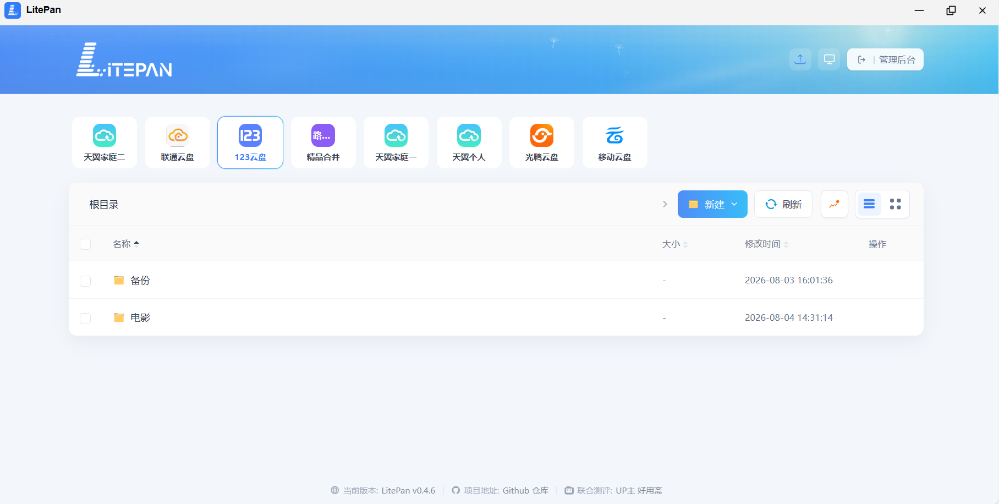

<a name="readme-top"></a>

<div align="center">


<br>

<a href="https://www.litepan.top"></a>
&nbsp;
<a href="https://space.bilibili.com/1501989416"></a>
&nbsp;
<a href="https://hub.docker.com/r/ponphil/litepan"></a>


[![docker-pulls][docker-pulls-shield]][docker-url]
[![version][version-shield]][docker-url]
[![license][license-shield]][license-url]

</div>


## ▎ 本分支说明（fork）

本仓库是 [LitePan](https://github.com/Ponphil/LitePan) 的分支，在保留上游全部功能的基础上，与原始版本的主要差异：

| 差异 | 说明 |
|------|------|
| 🆕 **联通云盘驱动** | 新增中国联通「沃云盘」（pan.wo.cn）支持：个人空间 / 家庭空间均可挂载，refresh_token 直连换新、自动续期，支持 302 直链与代理下载。上游 LitePan 暂无此驱动。 |
| ⬆️ **天翼云盘增强** | 家庭空间新增「家庭空间 ID」配置项；账号下存在多个家庭空间时可手动指定、精确挂载；留空则回退上游自动选择逻辑，与上游完全兼容。 |
| ⬆️ **云盘别名** | 支持聚合不同网盘文件夹到一个目录。 |
| ⬆️ **nyaa磁力搜索** | 首页增加磁力搜索（需要代理），更方便离线下载。 |
| ⬆️ **strm 刮削增强** | strm 刮削新增 metatube 刮削源，元数据覆盖更全（可刮削小姐姐）。该功能需独立部署 metatube 服务；如需一对一付费部署协助，请加 QQ 1500404845。 |
| 🎨 **移动端前端重构** | 前端页面全新重构，布局更简单、交互更人性化（详见下方）。 |

### 前端重构亮点

- **存储盘顶部平铺**：全部网盘横向卡片条展示，一键切换，状态一目了然；
- **双栏布局**：左侧收藏夹、右侧文件区，视觉更聚焦；
- **路径导航贴近文件**：面包屑紧贴文件列表上方，点击区域更大，跳目录更顺手；

<!-- TODO: 重构完成后替换为真实截图 -->


### 📦 下载 fnOS `.fpk` 安装包

本项目提供由 [LitePan-fpk](https://github.com/anxiangyipiao/LitePan-fpk) 自动构建的 fnOS 安装包，支持 `x86` 与 `arm64` 两种平台，可前往下载页面获取对应版本。


在 fnOS 中安装后，默认管理员账号密码均为 `admin`。

<br>

## ▎ Docker 部署

### 环境要求

- Docker ≥ 20.10
- Docker Compose ≥ 2.0

### 方式一：docker-compose（推荐）

```bash
# 克隆项目
git clone https://github.com/anxiangyipiao/LitePan.git
cd LitePan

# 启动（自动构建镜像 + 后台运行）
docker compose up -d --build
```

启动后访问 `http://你的IP:5211`，默认管理员账号密码均为 `admin`。

常用命令：

```bash
# 查看日志
docker compose logs -f

# 停止
docker compose down

# 重新构建（代码更新后）
docker compose up -d --build
```

### 方式二：飞牛 NAS（fnOS）

```bash
git clone https://github.com/anxiangyipiao/LitePan.git
cd LitePan
docker compose -f docker-compose.fnos.yml up -d --build
```

> fnOS 配置使用 `network_mode: "host"`，无需映射端口，直接访问 `http://你的IP:5211`。

### 方式三：手动构建

```bash
docker build -t litepan .

docker run -d \
  --name litepan \
  -p 5211:5211 \
  -v ./data:/app/data \
  -v ./strm:/app/strm \
  -v ./mounts:/app/mounts:shared \
  --device /dev/fuse:/dev/fuse \
  --privileged \
  litepan
```

### 数据目录说明

| 容器路径 | 说明 | 建议 |
|---------|------|------|
| `/app/data` | 数据库、配置、日志 | 必须持久化 |
| `/app/strm` | STRM 文件输出目录 | 必须持久化 |
| `/app/mounts` | FUSE 挂载点 | 需要 `:shared` 挂载模式 |

### 环境变量

| 变量 | 默认值 | 说明 |
|------|--------|------|
| `LITEPAN_DATA_DIR` | `/app/data` | 数据存储目录 |
| `LITEPAN_STRM_DIR` | `/app/strm` | STRM 输出目录 |
| `LITEPAN_LISTEN` | `:5211` | 监听地址 |
| `LITEPAN_LOG_LEVEL` | `info` | 日志级别（debug/info/warn/error） |
| `TZ` | `Asia/Shanghai` | 时区 |

<br>

## ▎ 功能简述

<table>
  <tr>
    <td width="50%" valign="top" align="center">
      <h3>多网盘聚合</h3>
      <p align="left">多账号统一管理，一个界面看完。</p>
      
    </td>
    <td width="50%" valign="top" align="center">
      <h3>跨盘秒传</h3>
      <p align="left">能秒传就秒传，否则自动上传。</p>
      
    </td>
  </tr>
  <tr>
    <td width="50%" valign="top" align="center">
      <h3>STRM 直连播放</h3>
      <p align="left">生成 <code>.strm</code>，对接 Emby / Jellyfin。</p>
      
    </td>
    <td width="50%" valign="top" align="center">
      <h3>STRM 刮削</h3>
      <p align="left">写 nfo / 海报，海报墙可追更。</p>
      
    </td>
  </tr>
  <tr>
    <td width="50%" valign="top" align="center">
      <h3>目录整理</h3>
      <p align="left">TMDB 识别，预览后再归档。</p>
      
    </td>
    <td width="50%" valign="top" align="center">
      <h3>自动联动</h3>
      <p align="left">整理、STRM、刮削、刷库串起来。</p>
      
    </td>
  </tr>
</table>

## ▎ 挂载与更多功能

支持 WebDAV 与 FUSE 本地挂载，另有 302 直链、缓存保持、命名对齐、离线下载等能力。

---

## ▎ 支持

<table>
  <tr>
    <td width="50%" valign="top">
      <h3>支持 LitePan</h3>
      <p>如果这个项目对你有帮助，欢迎点右上角 <strong>Star</strong>，也欢迎自愿赞赏。</p>
      
    </td>
   
  </tr>
</table>

## ▎ 反馈

外部贡献致谢见 [ACKNOWLEDGEMENTS.md](./ACKNOWLEDGEMENTS.md)。

---

## ▎ 许可

[PolyForm Noncommercial 1.0.0](./LICENSE) — 个人学习与非商业使用，**禁止商用**。  
第三方依赖见 [THIRD_PARTY_NOTICES.md](./THIRD_PARTY_NOTICES.md)。请遵守各网盘服务条款与当地法规。

[docker-pulls-shield]: https://img.shields.io/docker/pulls/ponphil/litepan?logo=docker&logoColor=white&style=flat-square
[version-shield]: https://img.shields.io/badge/Version-v0.5.0--Beta-6C63FF?style=flat-square
[license-shield]: https://img.shields.io/badge/License-PolyForm%20NC-red?style=flat-square
[docker-url]: https://hub.docker.com/r/ponphil/litepan
[license-url]: ./LICENSE
